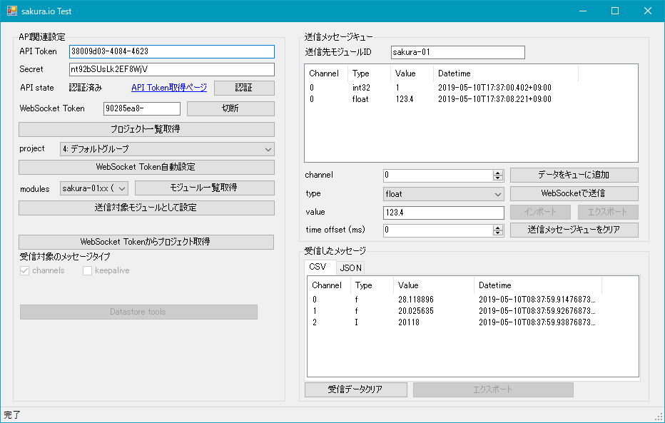

# SakuraIOTest
sakura.ioの機能を試すためのWindows用ツールです。

# 試すことができる機能
* 管理用API
    * プロジェクト一覧の取得
    * 特定のプロジェクトに所属するモジュール一覧の取得
* WebSocket連携
    * 通信モジュールへのメッセージ送信
    * 通信モジュールから送られてきたメッセージの受信

# ディレクトリ構成
[SakuraIOTestディレクトリ](SakuraIOTest/)以下に本体のソースコード、
[SakuraIOディレクトリ](SakuraIO/)以下にsakura.ioへのアクセスを行うライブラリのソースコードが格納されています。

# 動作環境
Windows 10上で動作することを確認しています。

動作には.NET Framework 4.6が必要です。
ただし、.NET Framework 4.6がインストールされていてもWindows 7以前のOSではWebSocket関連の機能が実装されていないため動作しません。

また、開発にはVisual Studio 2017 Communityを使用しています。

# 再頒布やサポートについて
本リポジトリに含まれるソースコードやビルド済みバイナリはApache License 2.0に基づき自由に使用・再頒布が可能です。

ただし、本リポジトリに含まれる内容について一切のサポート・保証等はありません。